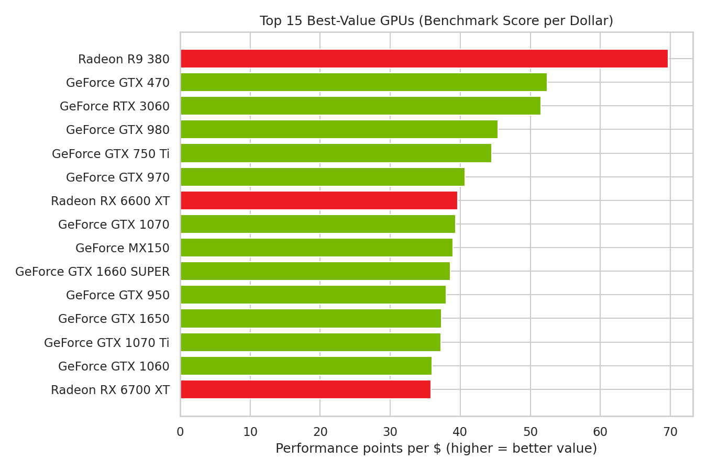
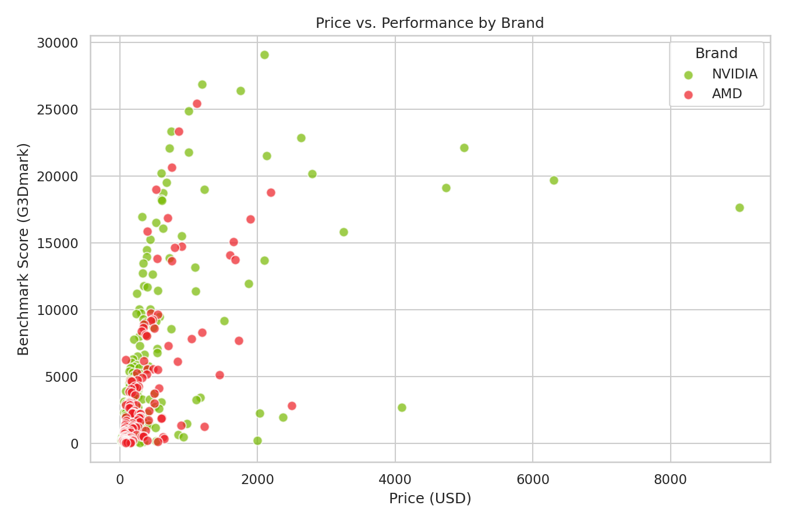
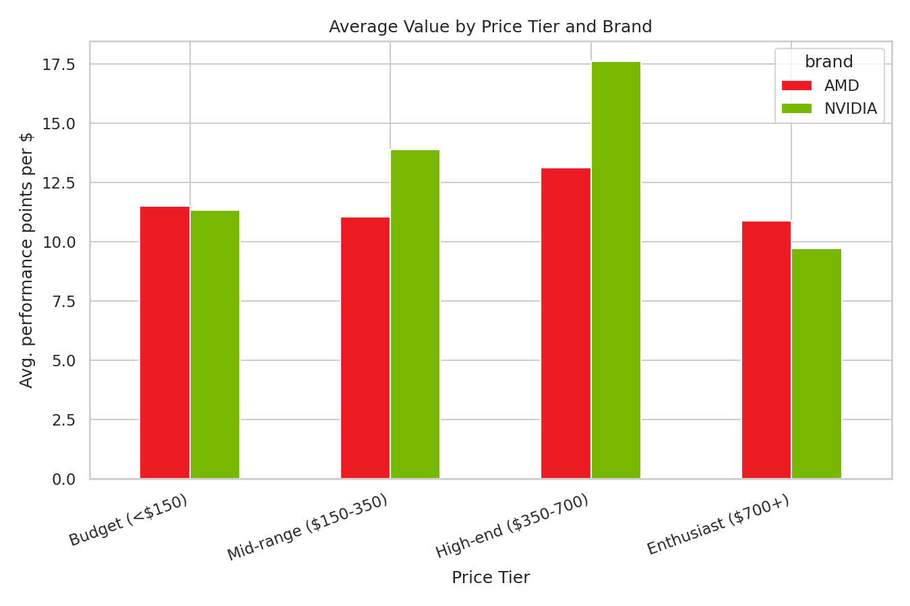
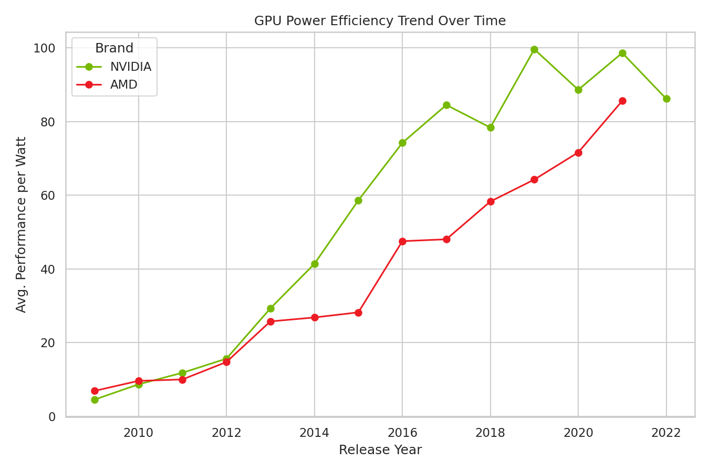

# 🖥️ GPU Price-to-Performance Analysis

Which graphics cards give you the most performance per dollar — and how does that value shift between NVIDIA and AMD, across price tiers, and over time?


##  Project Overview

This project analyzes 2,300+ GPUs (graphics cards) released between 2009 and 2022, combining
benchmark scores (PassMark G3Dmark) with retail prices to answer questions a PC retailer, IT
procurement buyer, or system builder would actually ask:

- Which GPUs deliver the best performance for the money?
- Is NVIDIA or AMD the better-value brand, and does that change by price tier?
- Does a higher price reliably mean better performance?
- Has power efficiency improved generation over generation?

I built this as a portfolio project while transitioning from **IT Support/Maintenance into Data
Analytics** — it reflects both my hands-on hardware background and the analytical workflow
(cleaning → EDA → visualization → interactive tool) expected in a data analyst role.

##  Key Insights

| Question | Finding |
|---|---|
| Best value GPUs | Previous-generation and mid-range cards top the rankings — the **Radeon R9 380** and **GeForce GTX 470/970/980** lead in performance-per-dollar |
| NVIDIA vs. AMD | NVIDIA averages a slightly higher value score (**12.98** marks/$) than AMD (**11.56** marks/$) across the full dataset |
| Price vs. performance | Only moderately correlated (**r ≈ 0.53**) — a higher price does not reliably mean better performance |
| Best price tier | The **High-end tier ($350–700)** offers the strongest average value for both brands — better than budget or flagship cards |
| Power efficiency | Performance-per-watt improves steadily for both brands from 2009 to 2022 |

## 📊 Visualizations

<table>
<tr>
<td width="50%"></td>
<td width="50%"></td>
</tr>
<tr>
<td width="50%"></td>
<td width="50%"></td>
</tr>
</table>

##  Tech Stack

- **Python** — pandas for data cleaning and feature engineering
- **Matplotlib / Seaborn** — static charts for the notebook and README
- **Jupyter Notebook** — the full analysis walkthrough, from raw data to conclusions
- **Streamlit** — an interactive dashboard to filter GPUs by brand, price, and release year

##  Project Structure

```
pc-hardware-project/
├── data/
│   ├── gpu_benchmarks_prices_raw.csv      # original dataset
│   ├── gpu_benchmarks_prices_clean.csv    # cleaned, analysis-ready dataset
│   └── README.md                          # data dictionary & source attribution
├── notebooks/
│   └── gpu_price_value_analysis.ipynb     # full analysis: cleaning → EDA → insights
├── dashboard/
│   └── app.py                             # interactive Streamlit dashboard
├── src/
│   ├── clean_data.py                      # reusable data cleaning script
│   └── make_charts.py                     # generates the README charts
├── images/                                # exported chart PNGs (used above)
├── requirements.txt
└── README.md
```

##  How to Run

```bash
# 1. Clone the repo and install dependencies
git clone https://github.com/<your-username>/gpu-price-performance-analysis.git
cd gpu-price-performance-analysis
pip install -r requirements.txt

# 2. Re-run the data cleaning (optional — the clean CSV is already included)
python src/clean_data.py

# 3. Explore the full analysis
jupyter notebook notebooks/gpu_price_value_analysis.ipynb

# 4. Launch the interactive dashboard
streamlit run dashboard/app.py
```

##  Methodology

1. **Data cleaning** — of the 2,317 raw records, ~84% were missing price data (older/niche cards
   PassMark benchmarked but that were never assigned a listed price) and were excluded, leaving
   383 GPUs with complete price, performance, and power data.
2. **Feature engineering** — computed `marks_per_dollar` (performance per $), `performance_per_watt`
   (efficiency), and bucketed cards into four price tiers.
3. **Exploratory analysis** — ranked GPUs by value, examined the price/performance relationship,
   compared brands within price tiers, and tracked efficiency trends over release years.
4. **Interactive dashboard** — rebuilt the core charts in Streamlit with live filters so a user can
   explore value within their own budget and brand preference.

## ⚠️ Limitations & Next Steps

- Prices are historical USD retail snapshots (mostly 2021–2022), not adjusted for regional markets
  like Saudi Arabia/GCC or current used-hardware pricing.
- A large share of the raw dataset lacked pricing and had to be dropped — a live pricing feed would
  strengthen the analysis.
- **Next step:** extend this pipeline to scrape live GCC marketplace listings (e.g. Amazon.sa, Haraj)
  and compare regional pricing against this global benchmark baseline — directly relevant to the
  PC hardware resale market in Saudi Arabia.

##  Data Source

GPU specifications, benchmark scores, and prices via [gradedSystem/GPU_Price_Specs](https://github.com/gradedSystem/GPU_Price_Specs)
(GitHub), originally scraped from PC Builder and cross-referenced with a public Kaggle dataset.
Full attribution in [`data/README.md`](data/README.md). Used here for non-commercial, educational purposes.

##  Author

**Mohamad Abdulkarim Alhamawi**
IT Maintenance Technician transitioning into Data Analytics | Jeddah, Saudi Arabia
📧 mohamad.abdulkarim.alhamwi@gmail.com
 | 🔗 [My linkedin:](https://www.linkedin.com/in/mohamadalhamawi/)

---
*If you find this project useful, feel free to star the repo!*
